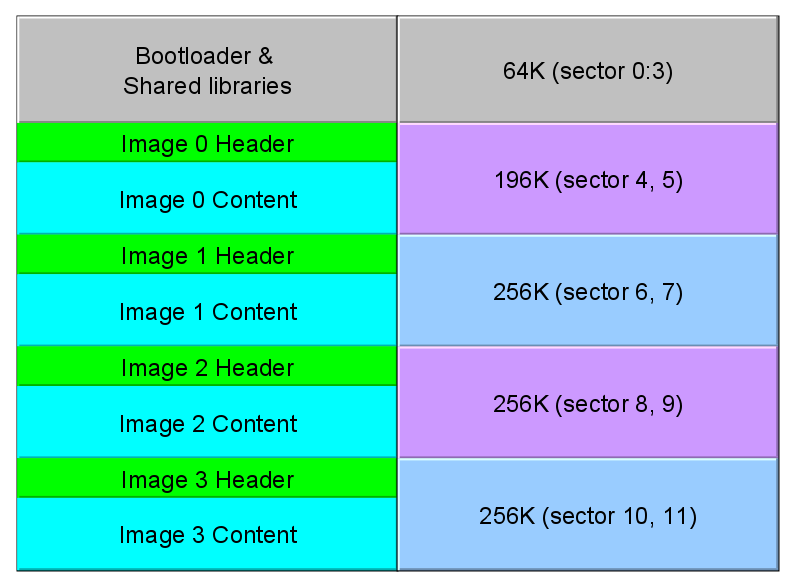
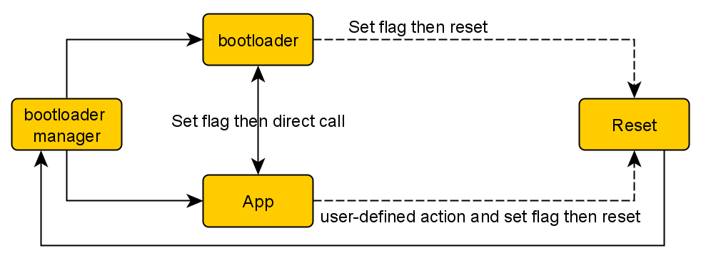
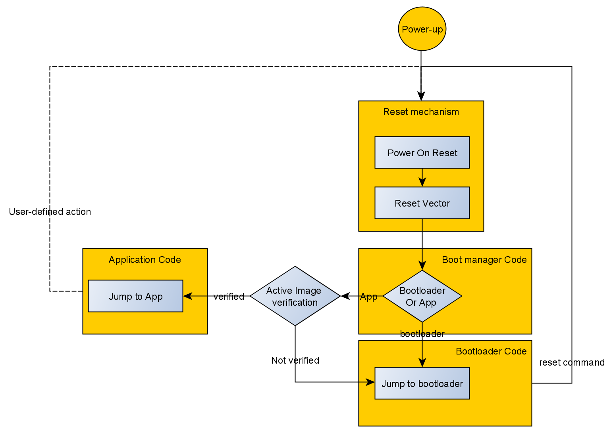
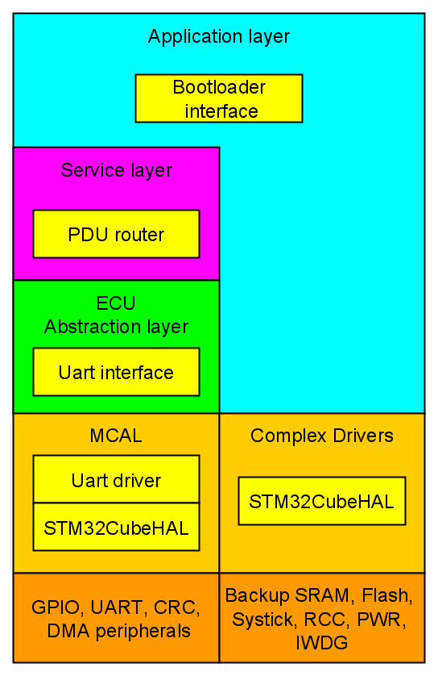
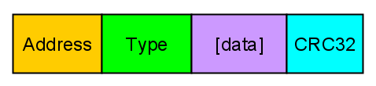

# About
A bootloader for STM32F407VG MCU. It's based on STM32CubeHAL. 
# Bootloader features:
- Flash, erase for a sector or an image (multiple sectors) and jump to the app.
- It supports four images with their headers. The images are with diffrerent sizes.
- CRC32 check for the programming records and for the entire image.
- It supports UART communication.
- Flasher python script.
- The content of the image is independent position code (IPC) while the image header must be at the start of the image.
- STM32CubeHAL is shared between the bootloader and the images.

# Memory design


# Bootloader design


# Bootloader sequence


# Software architecture


# PDU design


- Address: The least significant 16-bit of the address of the location of programming.
- Type: The action to be performed (erase, flash, reset, etc.)
- data (optional): the data for the specified action (flashing data, image number, etc.). Its maximum number of bytes is 16 in case of flashing.
- CRC32: CRC32 computed for the entire PDU.

# Tools used
- <a href="https://code.visualstudio.com/">Visual Studio Code</a>
- <a href="https://developer.arm.com/tools-and-software/open-source-software/developer-tools/gnu-toolchain/gnu-rm">GNU Arm Embedded Toolchain</a>
- <a href="https://www.gnu.org/software/make/">GNU Make</a>

# How to build the bootloader
- You should have <a href="https://www.gnu.org/software/make/">GNU Make</a> and <a href="https://developer.arm.com/tools-and-software/open-source-software/developer-tools/gnu-toolchain/gnu-rm">GNU Arm Embedded Toolchain</a>
- <code>cd</code> to the repository directory and run <code>make</code>, you should have the build folder containing the binaries.
- Flash the image using any STM32 MCU flashers (OpenOCD, STM32Cube programmer, etc.).

# How to use the bootloader

1. Include an image header in your application at the start of the image using linker script (you can use the one in the apps folder).
1. Fill the image header CRC32 of the entire image which can be calculated from the .hex file using the CRC calculator in apps folder. e.g.: 
    ```
    python app.py output.hex
    ```
1. Use the flasher script to:
    1. Erase the image. e.g.
        ```
        python flasher.py COM8 -a1 -i0
        ```
    1. Flash the image.
        ```
        python flasher.py COM8 -f output.hex -a0 -i0
        ```
    1. Choose the active image.
        ```
        python flasher.py COM8 -a5 -i0
        ```
    1. Reset MCU to let the active image work.
        ```
        python flasher.py COM8 -a4
        ```
    - To know how to use the flasher script run: 
        ```
        python flasher.py -h
        ```


# Important notes
- Backup SRAM is used as an EEPROM emulation. It means, it will act as an EEPROM as long as there's power on VBAT pin. For more information, visit this <a href="https://www.st.com/resource/en/application_note/dm00026574-eeprom-emulation-in-stm32f2xx-microcontrollers-stmicroelectronics.pdf">EEPROM emulation in STM32F2xx microcontrollers</a> PDF.

# Looking forward to implementing:
- CAN communication.
- Transport layer ISO-TP (ISO 15765-2)
- Delta file

# References
## English
- <a href="https://www.beningo.com/insights/white-papers/bootloader-design-for-microcontrollers-in-embedded-systems/">Bootloader Design for Microcontrollers in Embedded Systems</a> White paper
## Arabic
- <a href="https://www.youtube.com/playlist?list=PLl3yF2kjT6AzLxhOuCEBY-8RzOIB1sfnN">Embedded Boot-Loader Design Course</a> YouTube playlist
- <a href="https://www.youtube.com/playlist?list=PLPFp2zIiTnxV5e75pGKIccaR0BjmpIS79">Flash Memory and Bootloaders</a> YouTube playlist
